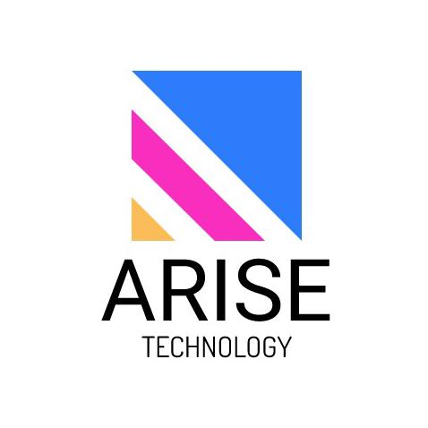

# 
ARISE TECHNOLOGY

  

   <em>
   "Rise up from every fall. Arise to greatness"
   </em>

<strong>Contact Informations:</strong>
   
email: projects@arisetechnology.com.br

   
phone: +55 27 999553448

   
Address: Vitória-ES, Brazil

# 
HawkAI Project

Security is a very important and present issue in our daily lives, especially when it comes to protecting our assets and our physical integrity. Unfortunately, crime rates in Brazil are still alarming: one person is robbed every 17 seconds and more than 4.4 million homes were robbed in the year 2022, in addition to losses of 5 billion dollars for trade with robberies and thefts.
It is clear that security measures, such as the use of surveillance systems and alarms, are essential to protect our assets. However, these measures are often insufficient to ensure effective security.
With that in mind, we developed HawkAI, an artificial intelligence monitoring system capable of detecting suspicious criminal activity. Integrating with existing security systems, such as surveillance cameras, alarms and security guards, HawkAI offers a more complete solution to protect assets and prevent criminal actions.
With the possibility of integrating the project with public security systems, HawkAI can become a powerful tool to combat large-scale crime. The system is capable of identifying suspicious activities, such as the presence of firearms or suspicious actions by people or animals, in real time. And, if any suspicious activity is detected, the system sends an alert to the responsible security team, accompanied by a video with date/time, location and a brief description of what was detected.
With HawkAI, it is possible to significantly increase the effectiveness of security systems, preventing criminal actions before they happen. In addition, integration with public security systems can contribute to greater security across the country.

# 
Project Specifications

# Repository

$ git clone https://github.com/Arise-Technology/mimir.git
$ pip install

## License

This project is licensed under the terms of the [MIT License](LICENSE).
The full text of the license can be found in the [LICENSE](LICENSE) file.
